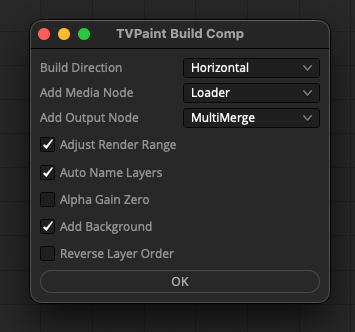

# TVPaint Data Nodes

## Overview

The TVPaint data nodes for Blackmagic Design Resolve/Fusion allow you to interact with 2D animation data inside a node graph. This approach works with a series of nodal operators that allow you to edit and modify the TVPaint JSON data on the fly.

This TVPaint implementation is based around the "ScriptVal" datatype in Fusion, and works using ideas pioneered by the Vonk Ultra data node project.

## Software Requirements

To run TVPaint based workflows on your Resolve/Fusion system you will need the following tools:

- BMD Resolve (Free) / Resolve Studio v18.5+
- BMD Fusion Studio
- Reactor Package Manager (Free)
- Vonk Ultra Data Nodes (via Reactor)

## Open Source Software License Term

- LGPL/GPL v3

## Installation

1. Install the Reactor Package Manager for Resolve/Fusion.

2. Install the Reactor package named "Vonk Ultra" that is found in the "Kartaverse/Vonk Ultra" category in the Reactor window.

3. Install the Reactor package named "TVPaint Data Nodes" that is found in the "Kartaverse/TVPaint" category in the Reactor window.

4. Quit and relaunch Resolve/Fusion once for the fuse nodes to load.

## TVPaint Scripts

Look in the Fusion "Script/TVPaint" menu to see the automation scripts.

### TVPaint Build Comp

Auto-build a comp node-graph based upon the active TVPaintLoader node selection.

### Show Fuses Folder

Opens the "TVPaint for Fusion" Fuses folder in a desktop folder browsing window.

`Fuses:/Kartaverse/TVPaint/`

### Show Comps Folder

Opens the "TVPaint for Fusion" Comp examples folder in a desktop folder browsing window.

`Reactor:/Deploy/Comps/Kartaverse/TVPaint/`

## TVPaint Node Categories

The TVPaint data nodes are separated into the following categories and sub-categories based upon the function they perform:

Camera
- TVPaintCameraFPS
- TVPaintCameraPixelAspectRatio
- TVPaintCameraSize

Clip
- TVPaintClipDPI
- TVPaintClipFPS
- TVPaintClipMarkIn
- TVPaintClipMarkOut
- TVPaintClipName
- TVPaintImageCount

Create
- TVPaintBackground

IO
- TVPaintLoader

Layer
- TVPaintLayerBlendMode
- TVPaintLayerCount
- TVPaintLayerName
- TVPaintLayerOpacity

Link
- TVPaintLinkFilename
- TVPaintLinkImage

Project
- TVPaintProjectFormat
- TVPaintProjectVersion

## TVPaint Node Usage

The Fusion node graph allows for the use of "data nodes". This nodal operator driven approach allows the individual node based input and output connections to pass TVPaint encoded documents "down the flow" in a parametric fashion.

This is achieved by encoding the raw TVPaint JSON information into a Fusion datatype called a "ScriptVal" which is represented by a Lua table structure. The TVPaint data is passed between node input and output connections in a way that allows you to visually control the operations that dynamically create, load, edit, render, and save the cell animation.

An TVPaint node graph starts with an "TVPaintLoader" node that imports an existing TVPaint (JSON formatted) file from disk.
